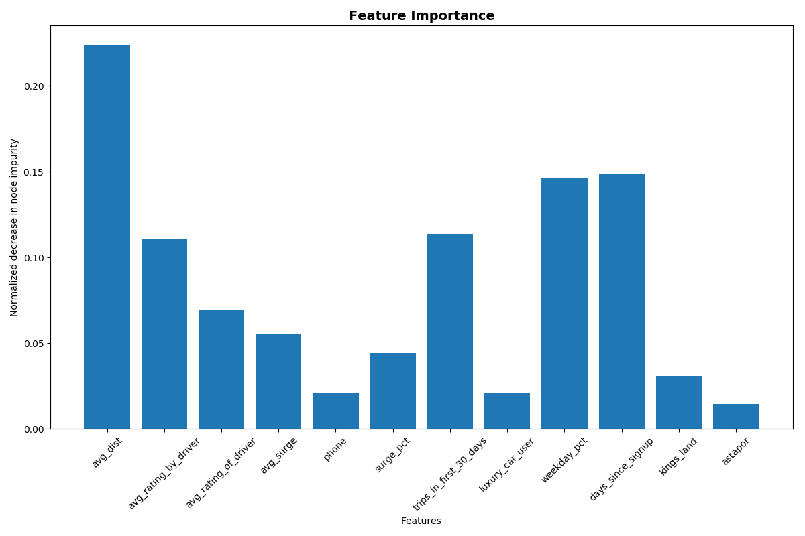
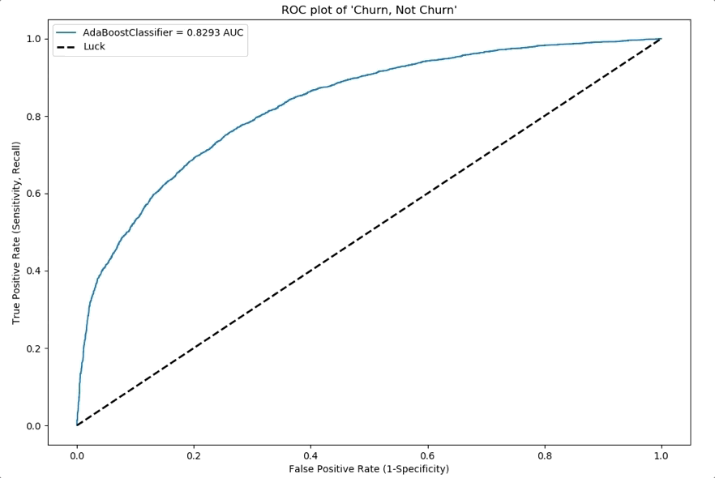
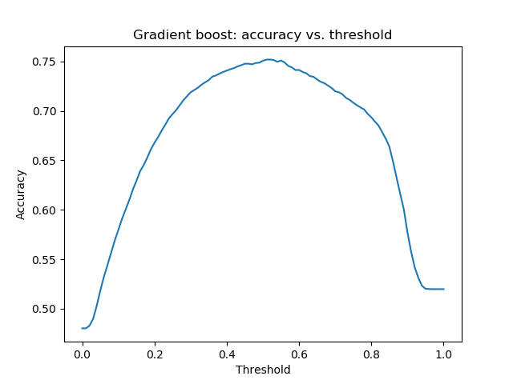
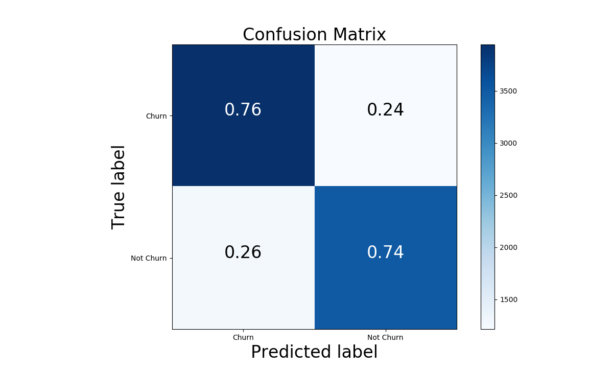

# To Churn or Not to Churn

by Chris Lawton, Paul Sandoval, Troy Kayne and Lyssa Treibitz

### EDA

Looking at our data we immediately noticed that there was no confirmed target value. Therefore, we needed to determine our own metric for what was considered churn.

We decided on the assumption that if a customer hadn't used the rideshare app in two months they had 'churned'. We calculated the days since their last trip (using the current date as the max last trip date in the file) and assigned True to those customers who hadn't had a trip in more than 60 days.

To handle missing data in the both the ratings columns, we used Iterative Imputer to fill in the values. For missing values in the 'phone' column we chose to remove the ~300 rows without a phone type listed and changed the iPhone/Android entries to Boolean. Finally, we broke out the 'city' column into two boolean columns.

To prevent leakage, we removed the 'last_trip_date' column from the data set before performing further analysis. From this altered data set.  We plotted our feature importance:

### Analysis

In order find the most predictive result, we decided to fit multiple type of Classifier models:

- KNN
- Decision Tree
- Random Forest
- Gradient Boosting
- Ada Boosting

Once we fitted the models, we plotted them on a ROC curve to determine which had the high True Positive vs False Positive rate. Based on the results we found, we found that Gradient Boost was the best model to use because it had the highest AUC of .83.

 Using Gradient Boosting Classifier, we then plotted our training data against various probability thresholds to determine which threshold produced the highest accuracy and recall.

 |                   |   Accuracy |   Recall |
|:------------------|-----------:|---------:|
| kNN               |      0.715 |     0.7  |
| Decision Tree     |      0.69  |     0.67 |
| Random Forest     |      0.74  |     0.7  |
| Gradient Boosting |      0.75  |     0.71 |
| AdaBoosting       |      0.74  |     0.76 |

We found that the threshold that produced the highest accuracy for Gradient Boosting was .52

Fitting our training data into the Gradient Boosting Classifier with this optimized threshold, we calculated the resulting Confusion Matrix:

  

### Summary

For now, we believe accuracy to be the best metric to determine our predictive model without knowing what the marketing budget of our ride sharing company is.  With more budget information, we would prefer to use recall (the model with the highest recall score was Ada Boosting) as our metric in order to minimize False Negatives so that we could appropriately incentivize waning riders. Moving forward, to deter riders from churning, we would send coupons before they reached the 60 day churn window.
