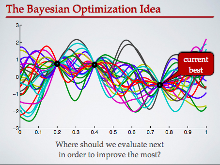

# Team


```text
Ryan Curry
Trent Fowler
Paul Sandoval
Joe Shull
Scott Wigle
```

### What we planned to do
* Predict next day closing price
  * 1) Build a simple logistic regression to predict if the next day will go up or down.
    * Will be a good base to show it preforms poorly.
  * 2) Update an existing LSTM to predict stock prices.
    * We used Bayes Theorem to conduct a search through hyper-parameter space looking for the optimum dimensions of the input vector.

### Data

The data consisted of multiple stocks with the open, high, low, close, volume, and date.  We decided to focus on a single stock for this project, Apple.


## Linear and Logistic for base line
The below graph show that linear and logistic regressions are not the best for predicting stock prices.  


ROC is for an binary up or down based on the previous days features.


## Bayes LSTM Model
We used Bayesian optimization to determine the sample data window value by taking samples of different sizes. Bayesian optimization can predict loss functions (in shape) and find optimal sample size when it reaches the minimum.





To find the best point to sample from next, choose the point that maximizes an acquisition function (expected improvement) where x_hat is the current optimal set of hyperparameters.


# Our Bayesian model output
Error as a function of window size (1,30)


## LSTM Model

Inspired by the architecture of the human brain, Artificial Neural Networks have been successfully deployed in a vast number of applications. One drawback from which they suffer is that they have no built-in ability to track long-term dependencies with a memory, which means that they aren’t as effective for sequential inputs which are contextually connected to one another.

An early attempt to overcome these deficiencies was the Recurrent Neural Network. RNNs have a simple loop which implements an extremely basic version of memory.

Their downfall is that, beyond a relatively few number of layers they suffer from gradients which either vanish or explode. The reason this is problematic is that in many datasets prediction requires tracking dependencies over long periods of time.

LSTMs are an iteration on standard RNNs which get around some of these difficulties (by being way, way more complicated). Within each module of an LSTM are four gated NNs, each with its own weights. The forgetting gate uses a sigmoid function to determine how much of the raw input data gets added to the cell memory. The input function uses a combination of a sigmoid and a tanh* function to process raw input data and add this to the cell memory. This twice-updated cell memory is used in tandem with the final sigma gate to determine the cell’s output, which is also fed into the next module.

What’s fascinating is that the equations for each of these gates look almost identical; other than subscripts, almost nothing changes. Which means almost all the functionality of the LSTM is contained in weight updates. How this is the case remains a mystery; science may never understand this beautiful, magical process.

* It needn’t be tanh, it can be any ‘squashing nonlinearity’.


### Our prediction with simple LSTM


# Future Work
  * Test our Baysian model on the full set.
    * Just got it working
  * Would be cool to try and do some Reinforcement learning and set up our own gym environment.
